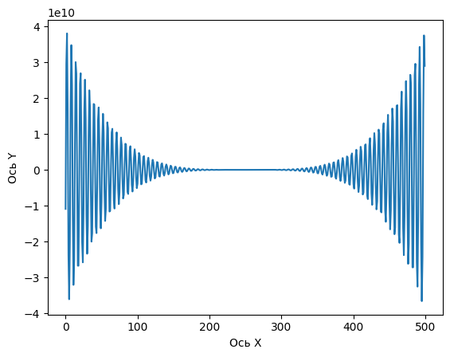

# Итоговая работа 

## Дана формула для подсчета

*f(x) = -12x^4*sin(cos(x)) - 18x^3+5x^2 + 10x - 30*

1. Определить корни

    **функция имеет бесконечное кол-во корней**
1. Найти интервалы, на которых функция возрастает

1. Найти интервалы, на которых функция убывает

1. Построить график

    

1. Вычислить вершину

    **Количество вершин бесконечное множество**

1. Определить промежутки, на котором f > 0

    **бесконечно**

1. Определить промежутки, на котором f < 0

   **бесконечно**